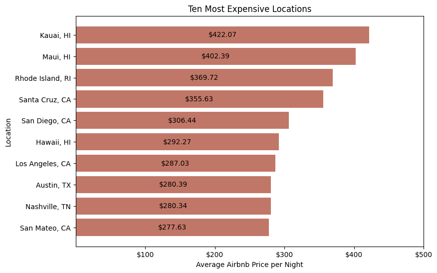
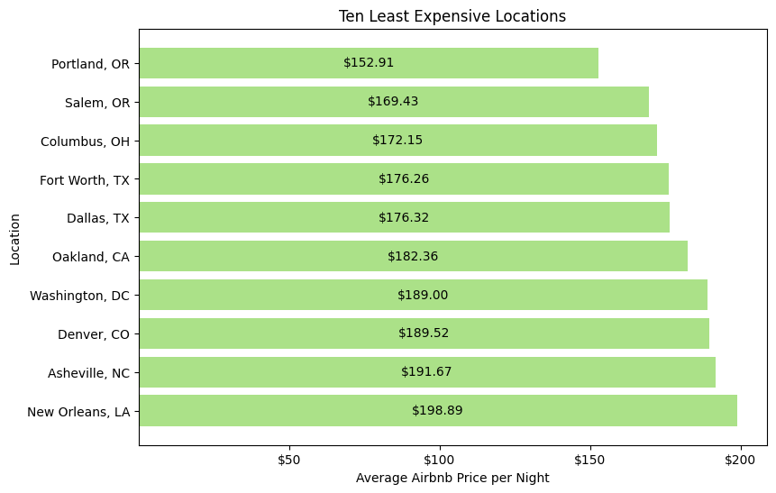
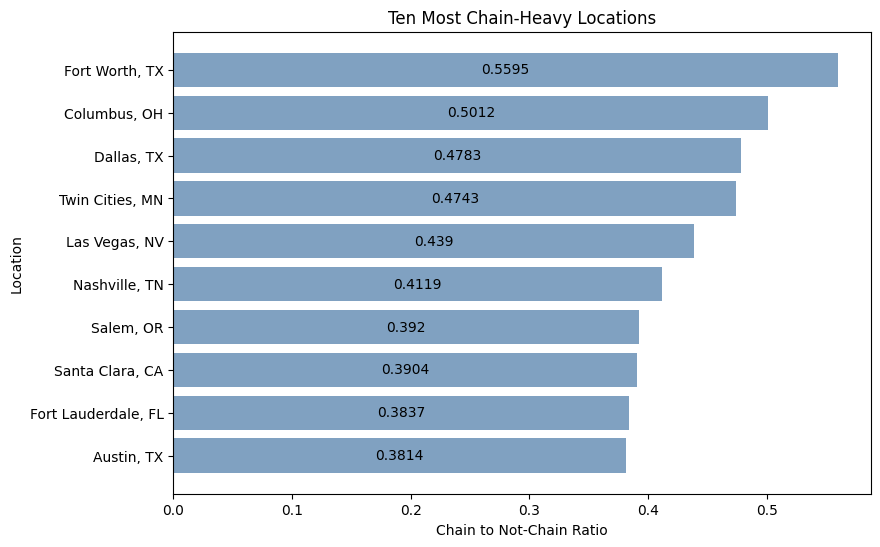
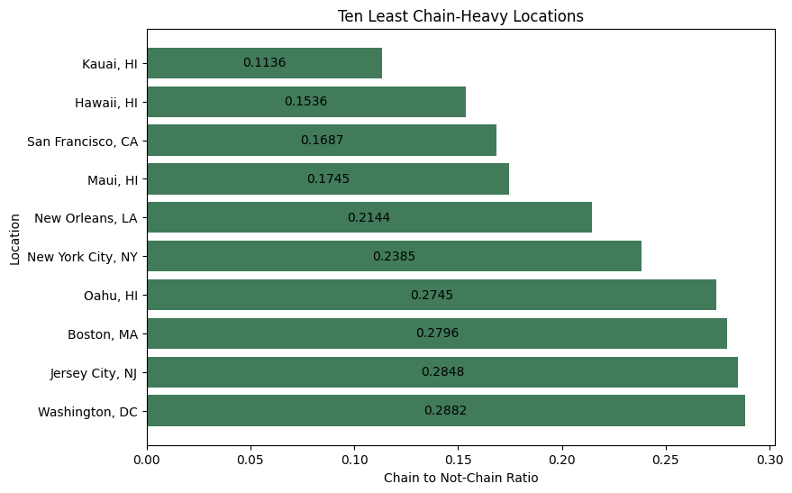
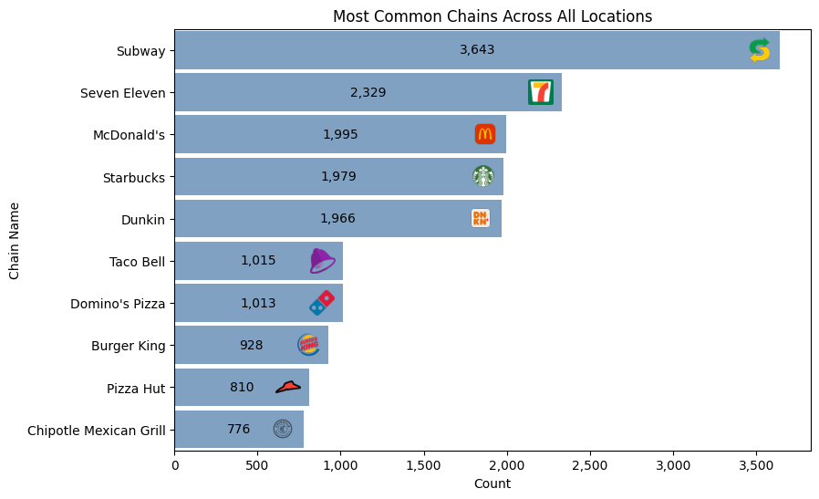
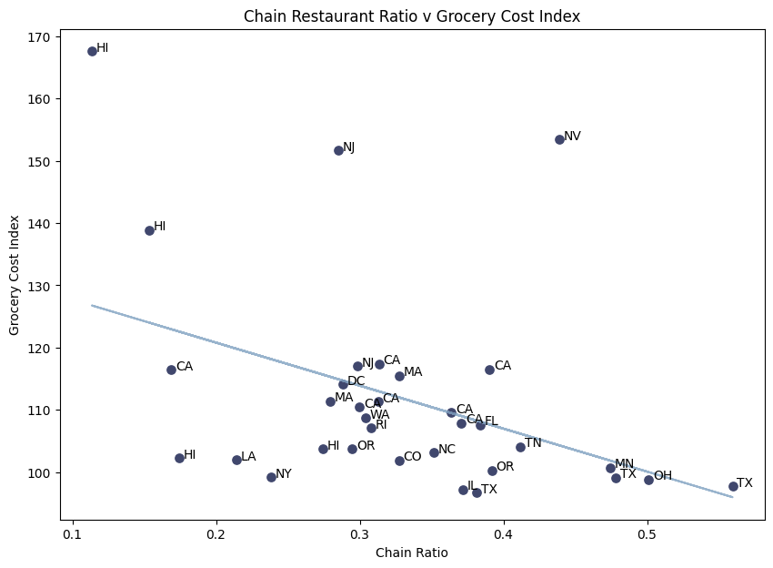
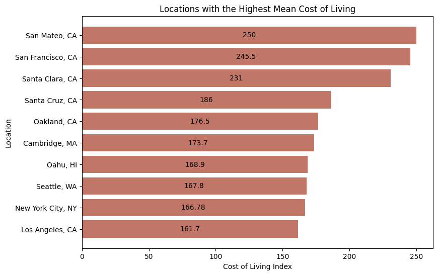
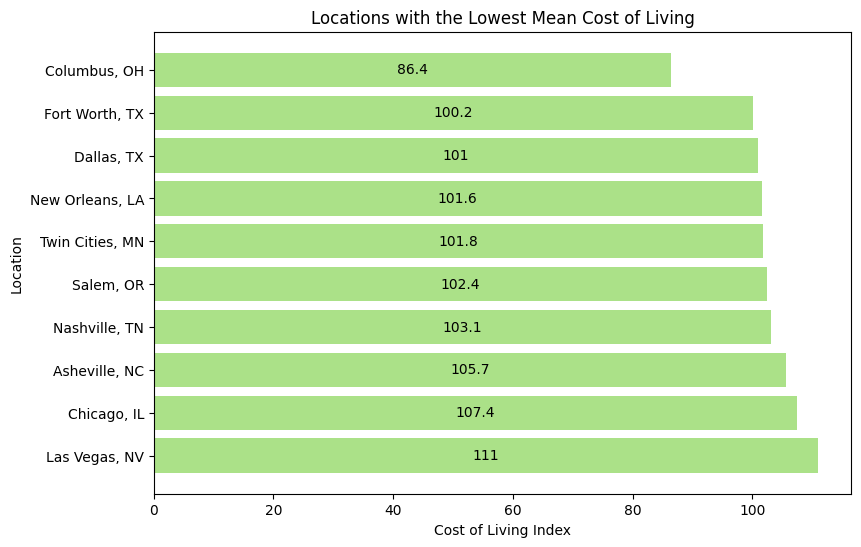
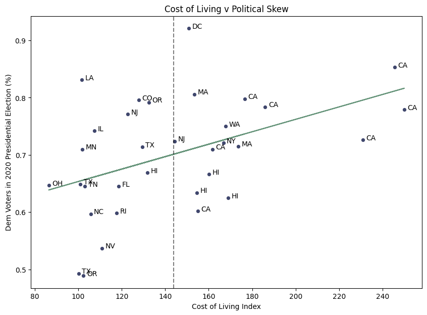

# Remote Work Location Recommender

### **Table of Contents**
 [Executive Summary](#executive-summary)
 [Data Dictionaries](#data-dictionaries)
 [Data Acquisition & Cleaning](#data-acquisition-and-cleaning)
 [EDA](#exploratory-data-analysis)
 [Building Recommendation Functions](#building-recommendation-functions)
 [Conclusion and Next Steps](#conclusion-and-next-steps)

# Executive Summary

**Problem Statement**:

I work at ABC Marketing, Inc. and we just signed Airbnb as our latest client.

They’ve asked us to build a web application that is easy to use and will drive repeat traffic to their website.

Given that Forbes has projected 25% of all professional jobs in North America will be remote by the end of 2022, our goal is to create a ready-for-launch remote work location recommendation system that drives users directly to Airbnb’s page.

# Data Dictionaries

Due to the usage of several datasets, all data dictionaries are in their respective directories and linked separately here:

- Data dictionary for [Airbnb Dataset](./datasets/airbnbs/airbnb_data_dict.md)
- Data dictionary for [Chain Restaurant Dataset](./datasets/things_to_do/chain_rest_data_dict.md)
- Data dictionary for [Cost of Living Dataset](./datasets/cost_of_living/cost_of_living_data_dict.md)
- Data dictionary for [Weather Dataset](./datasets/weather/weather_data_dict.md)
- Data dictionary for [Walkability Dataset](./datasets/walkability/walkability_data_dict.md)

# Data Acquisition and Cleaning
Notebook can be viewed [here](./notebooks/01_data_acq_clean.ipynb).

In order to build a system that could recommend a location based on user input, we needed to compile data that coincided with the questions we believe we'd be asking of the user. Below are brief summaries of the datasets used, as well as the sources.

#### **Datasets:**
1. Airbnb Data - 279k observations
- 13 features for each Airbnb listing including neighborhood, price per night, and minimum nights required for booking, all downloaded from [Inside Airbnb](http://insideairbnb.com/get-the-data/).

2. Chain Restaurant Data - 155k observations
- 13 features relating to each restaurant listed, including name, type of cuisine, urban area location, and whether the restaurant qualifies as a chain. Data provided courtesy of [Friendly Cities Lab](https://github.com/friendlycities-gatech/chainness).

3. Cost of Living Data - 33 observations
- 16 features relating to various socioeconomic and political characteristics of each location. Data was pulled from [BestPlaces.net](https://www.bestplaces.net/) for each location and aggregated.

4. Weather Data - 33 observations
- Two separate datasets detailing monthly temperature and rainfall trends for each location, from [The National Centers for Environmental Information](https://www.ncei.noaa.gov/). Data was aggregated into one larger dataset for subsequent usage.

5. Walkability Data - 40k observations
- 46 features for each census block including population demographics, auto and transit scores, and walkability from the [US Environmental Protection Agency](https://www.epa.gov/smartgrowth/smart-location-mapping#walkability).

# Exploratory Data Analysis
Notebook can be viewed [here](./notebooks/02_eda.ipynb).

The purpose of this notebook is to explore the various aspects in each of the datasets, helping us to hone in on the useful features that can be used in our functions and identify any patterns or inconsistencies that might cause problems when making recommendations. Following are examples of the explorations conducted:

**Key Findings**

Which locations have the most expensive Airbnb listings?

Which locations have the least expensive Airbnb listings?

Which locations have the highest ratios of chain restaurants?

Which locations have the lowest ratios of chain restaurants?

What are the most common chains across all locations?

Are there more chains in locations where the grocery cost index is higher?

Which locations have the highest costs of living?

Which locations have the lowest costs of living?

Do we see a relationship between cost of living and political lean?

# Building Recommendation Functions
Notebook can be viewed [here](./notebooks/03_building_rec_function.ipynb).

We built four functions in total, briefly summarized below:

1. User Input Conversion
- Meant to take in responses from a live user and convert into usable metrics.

2. Cosine Similarity for Single Recommendation
- Finds the single location with the nearest cosine similarity and returns as a recommendation.

3. Cosine Similarity for Multiple Recommendations
- Finds the five locations with nearest cosine similarity and returns all five in recommendation.

4. KMeans Cluster for Randomized Recommendation
- Uses KMeans to group the locations, then returns a random recommendation from the list of locations that were in the same cluster.

We selected the [user input conversion](./streamlit/stlib/user_input_converter.py) and [single-recommendation cosine](./streamlit/stlib/generate_rec.py) functions to use in our Streamlit web app.

# Conclusion and Next Steps

**Conclusions**

**Combining multiple datasets comes with challenges**

Although we made sure to pull data from only reputable sources, a few of our datasets were given on a neighborhood scale, while others were on a city-level scale. This is not inherently an issue, but it does slightly diminish the interpretability of our findings and creates significantly more work in validating.

**There are likely patterns in the data that were overlooked**

Due to the timeline and scope of the project, we weren't able to explore each of the datasets to the degree that we would have liked. Given that we were able to identify a probable regional trend in our initial EDA, it appears likely that there are more patterns that exist within the data and could be used in future versions of our function.

**The application works, but could be improved**

While we were able to build an application that provides location recommendations, we do feel that there are a few changes (detailed in Next Steps section below) that could be made to increase the likelihood of repeat traffic from users.

In all, we would consider the problem statement to be mostly met, but with a few necessary revisions before presenting to the client and going to market.

**Next Steps**

1. Added locations
- Ideally, we would be recommending various cities in every state and eventually, in international locations as well.

2. NLP on Airbnb listing names and descriptions
- Run the words used in each listing name and description through Count Vectorizer/Tfidf, and from there, generate a list of selected words the user can choose from that match their preferences.

3. More data
- The typical data science response of: more information needed. Specifically around local communities and activities (e.g. music scene if user wants to live somewhere that has multiple venues or more opportunities to see live music), nightlife, population diversity, etc. All of this would assist us in providing more tailored recommendations.

**Web Application**

To take a look at the finalized version of our web app for Airbnb, please click [here](https://cynthia-rodriguez1-wfh-loc-streamlitstlibfinal-draft-app-enq3bb.streamlit.app/).

**Presentation**

See [here](./addtl/wfh_recommender_pres.pdf) for a brief, fairly non-technical presentation summarizing our data collection process, exploration, and final recommendation system.

**Works Cited**

Please see [here](./addtl/works_cited.pdf) for an exhaustive list of resources used in this project.
